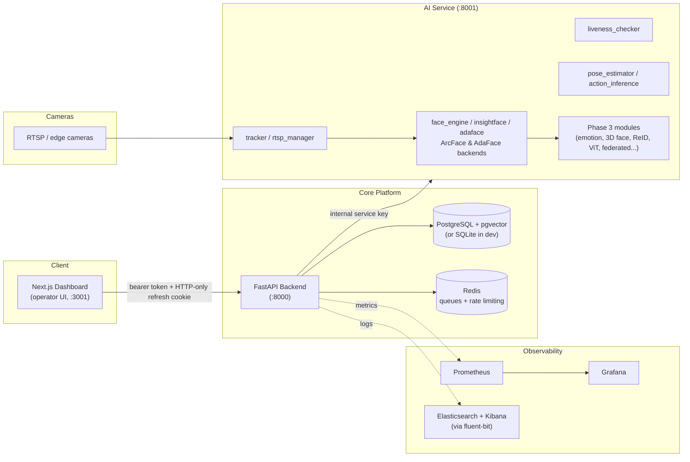
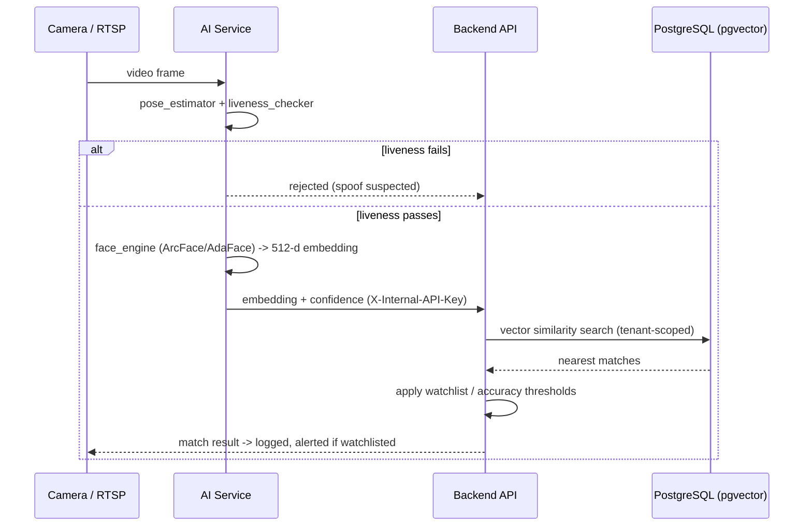

# SentinelCV

SentinelCV is a multi-tenant visitor-tracking and facial-recognition platform: a Next.js operator dashboard, a FastAPI backend, and a dedicated AI service for face/person recognition, liveness detection, and camera workflows. It was built as a Final Year Project and designed around production concerns — tenant isolation, auditability, encrypted biometric storage, and a large set of opt-in experimental recognition modules that stay off by default.

> This is the curated public snapshot of the project (single squashed commit, no development history). Internal planning docs and CI artifacts from the private working repo are not included here.

## Contents

- [Architecture](#architecture)
- [Core features](#core-features)
- [Experimental / Phase 3 modules](#experimental--phase-3-modules)
- [Tech stack](#tech-stack)
- [How recognition works](#how-recognition-works)
- [Configuration](#configuration)
- [Running it locally](#running-it-locally)
- [Security model](#security-model)
- [Observability](#observability)
- [Repository structure](#repository-structure)

## Architecture



The backend never talks to cameras or runs inference itself — it dispatches to the AI service (`AI_SERVICE_URL`) over an internal-key-guarded HTTP boundary, and persists results (visitor records, embeddings, logs, alerts) behind organization-scoped tenant filtering.

## Core features

| Area | What it does |
|---|---|
| **Visitors & watchlists** | Enroll, search, and match visitors; maintain watchlists with alerting on match |
| **Missing persons / disaster response** | Create disaster events, bulk-import missing-person records, privately report located people, review AI-suggested matches before confirming a case |
| **Live camera sessions + registry** | `camera.py` handles live WebSocket recognition sessions; `cameras.py` is the separate device registry (RTSP config, edge device pairing) |
| **Edge devices** | Register and manage edge-deployed recognition hardware, with export tooling (`ai_services/edge_export.py`) |
| **Logs & audit trail** | Recognition event logs, plus a separate immutable audit-log surface for compliance-relevant actions |
| **Users & organizations** | Multi-tenant org administration, per-user RBAC |
| **LDAP / SSO** | LDAP directory auth, legacy OAuth SSO (`sso_api.py`), and SAML SSO (`sso.py`) — two distinct auth flows, not interchangeable |
| **Compliance / GDPR** | Consent tracking, data subject access/erasure requests (`compliance.py` and `gdpr_api.py` are duplicate surfaces covering related but distinct workflows) |
| **Liveness detection** | Anti-spoofing checks before a recognition result is trusted |
| **Analytics, reports, recommendations, data quality, accuracy monitoring** | Operational dashboards over recognition throughput, match accuracy, and data health |
| **Webhooks & notifications** | Outbound event delivery and internal notification ingestion |
| **Carbon metrics** | Tracks estimated compute/energy footprint of recognition workloads |

## Experimental / Phase 3 modules

A large second tier of recognition research is implemented but **disabled by default** and blocked from mounting in production regardless of flags:

`vision_transformers`, `three_d_face`, `multimodal`, `federated_learning`, `advanced_recognition`, emotion recognition, action recognition, cross-camera re-identification, multispectral imaging, gait/voice recognition, model A/B testing, synthetic data generation, temporal augmentation, and mobile sync.

Each has its own env flag (`ENABLE_EMOTION_RECOGNITION`, `ENABLE_3D_FACE`, `ENABLE_VIT_RECOGNITION`, etc.) so individual modules can be turned on without the coarse `ENABLE_PHASE3_FEATURES` switch. See [AGENTS.md](AGENTS.md) for the full flag table — this is intentionally the most detailed reference doc kept in the public release.

## Tech stack

| Layer | Technology |
|---|---|
| Frontend | Next.js 16, React 19, Tailwind CSS 4, Recharts, Framer Motion, Playwright (e2e), Jest |
| Backend | FastAPI, SQLAlchemy, Alembic, Pydantic |
| Database | PostgreSQL + pgvector (production) / SQLite (local dev, encrypted-JSON embedding fallback) |
| Queue / cache | Redis (durable queues, distributed rate limiting) |
| AI service | InsightFace, AdaFace, ONNX Runtime, MediaPipe (face/pose landmarking), custom liveness + tracking pipeline |
| Observability | Prometheus, Grafana, Elasticsearch, Kibana, Fluent Bit |
| Deployment | Docker Compose (dev, e2e, prod, prod-green/blue-green), Kubernetes manifests (`ops/k8s`), Nginx |

## How recognition works



`SENTINELCV_STRICT_RECOGNITION=1` on the AI service (the default in both production Docker Compose files) refuses to enroll an identity off the weak 32×32-grayscale fallback embedding — it requires a real ArcFace/AdaFace backend. The backend's `/health/readiness` endpoint fails outright (not just warns) in production if the AI service can't confirm a real backend is loaded.

## Configuration

Copy the example env file and fill in real values before running anything:

```powershell
Copy-Item .env.example .env
```

Key variables (full reference in [AGENTS.md](AGENTS.md)):

| Variable | Purpose |
|---|---|
| `SECRET_KEY` | JWT signing — must be ≥32 chars in production |
| `EMBEDDING_KEY_SECRET` | Encrypts stored biometric embeddings — must differ from `SECRET_KEY` |
| `INTERNAL_SERVICE_KEY` | Guards internal AI-service ingestion endpoints (`/api/v1/logs/`, `/api/v1/notifications/`, `/api/v1/visitors/search`) |
| `METRICS_TOKEN` | Guards `/metrics`; leave unset only for local scraping |
| `ENFORCE_TENANT_FILTER` | Global ORM tenant filter, **on by default** — never disable outside tests |
| `ENABLE_PHASE3_FEATURES` | Mounts all experimental routers at once (blocked in production) |
| `REDIS_URL` | Enables durable queues and distributed rate limiting |
| `AI_SERVICE_URL` | Where the backend reaches the AI service (default `http://127.0.0.1:8001`) |
| `SENTINELCV_ENV` | Set to `production` to enforce stricter startup checks |

Never commit a real `.env` — only the `.example` files are tracked here.

## Running it locally

**Full stack (recommended):**

```powershell
docker compose up --build
```

This brings up Postgres, Redis, the backend, a queue worker, the frontend, the AI service, and the full observability stack (Prometheus, Grafana, Elasticsearch, Kibana, Fluent Bit).

**Backend only:**

```powershell
cd backend
python -m pip install -r requirements.txt
python -m uvicorn main:app --reload --host 0.0.0.0 --port 8000
```

**Frontend only:**

```powershell
cd frontend
npm install
npm run dev
```

Then check `http://localhost:8000/health/readiness`, and open the dashboard at `http://localhost:3001`.

## Security model

- **Auth:** short-lived bearer access token held in frontend memory, rotated refresh token in an HTTP-only cookie.
- **Tenant isolation:** `ENFORCE_TENANT_FILTER` is on by default across the ORM; operator routes that intentionally cross tenants use `execution_options(skip_tenant_filter=True)` explicitly rather than disabling the filter globally.
- **Internal service boundary:** log ingestion, notification ingestion, and internal visitor search all require `X-Internal-API-Key` — these are not meant to be reachable from the public internet directly.
- **Biometric storage:** embeddings are encrypted at rest (encrypted JSON on SQLite, `Vector(512)` on PostgreSQL with pgvector) using a key separate from the JWT signing key.
- **Experimental surfaces:** every Phase 3 / research router is opt-in and explicitly blocked from mounting when `SENTINELCV_ENV=production`, regardless of flags.

## Observability

`ops/grafana/dashboards` and `ops/logging` define the default Grafana dashboards and log pipeline config; `ops/k8s` has Kubernetes manifests for a non-Compose deployment. Prometheus scrapes `/metrics` (token-guarded when `METRICS_TOKEN` is set).

## Repository structure

```text
backend/       FastAPI routes, services, SQLAlchemy models, Alembic migrations
frontend/      Next.js dashboard and API client
ai_services/   Face/pose/liveness recognition pipeline and Phase 3 research modules
scripts/       Local startup, migration, benchmarking, and dev tooling
ops/           Grafana dashboards, log pipeline config, Kubernetes manifests
shared/        Code shared between backend and AI service
tools/         Misc developer utilities
alerts/        Alerting rule definitions
models/        Bundled model assets (MediaPipe landmarkers); recognition backbones are fetched via scripts/download_models.py
```

For agent/AI coding-assistant conventions, canonical source-of-truth file locations, and the full environment variable table, see [AGENTS.md](AGENTS.md).
